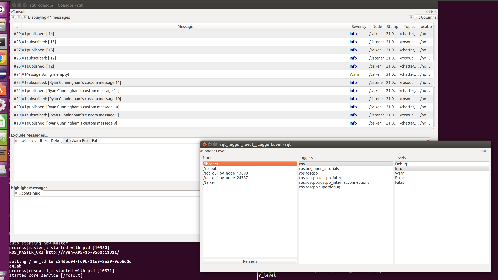

[](https://opensource.org/licenses/BSD-2-Clause)

# ROS Beginner Tutorials

Simple publisher and subscriber nodes and service server created by following the [ROS tutorials](https://wiki.ros.org/ROS/Tutorials/).

## License

BSD License
Copyright 2019 Ryan Cunningham

```
Redistribution and use in source and binary forms, with or without modification, are permitted provided that the following conditions are met:

1. Redistributions of source code must retain the above copyright notice, this list of conditions and the following disclaimer.

2. Redistributions in binary form must reproduce the above copyright notice, this list of conditions and the following disclaimer in the documentation and/or other materials provided with the distribution.

THIS SOFTWARE IS PROVIDED BY THE COPYRIGHT HOLDERS AND CONTRIBUTORS "AS IS" AND ANY EXPRESS OR IMPLIED WARRANTIES, INCLUDING, BUT NOT LIMITED TO, THE IMPLIED WARRANTIES OF MERCHANTABILITY AND FITNESS FOR A PARTICULAR PURPOSE ARE DISCLAIMED. IN NO EVENT SHALL THE COPYRIGHT HOLDER OR CONTRIBUTORS BE LIABLE FOR ANY DIRECT, INDIRECT, INCIDENTAL, SPECIAL, EXEMPLARY, OR CONSEQUENTIAL DAMAGES (INCLUDING, BUT NOT LIMITED TO, PROCUREMENT OF SUBSTITUTE GOODS OR SERVICES; LOSS OF USE, DATA, OR PROFITS; OR BUSINESS INTERRUPTION) HOWEVER CAUSED AND ON ANY THEORY OF LIABILITY, WHETHER IN CONTRACT, STRICT LIABILITY, OR TORT (INCLUDING NEGLIGENCE OR OTHERWISE) ARISING IN ANY WAY OUT OF THE USE OF THIS SOFTWARE, EVEN IF ADVISED OF THE POSSIBILITY OF SUCH DAMAGE.

```

## Dependencies

### Install ROS

Install ROS Kinetic on Ubuntu system (full installation guide at [ROS installation page](https://wiki.ros.org/kinetic/installation/Ubuntu)):

```
sudo sh -c 'echo "deb http://packages.ros.org/ros/ubuntu $(lsb_release -sc) main" > /etc/apt/sources.list.d/ros-latest.list'

sudo apt-key adv --keyserver 'hkp://keyserver.ubuntu.com:80' --recv-key C1CF6E31E6BADE8868B172B4F42ED6FBAB17C654

sudo apt-get update
sudo apt-get install ros-kinetic-desktop-full
```

### Create Catkin Workspace

Create a Catkin workspace if one does not already exist:

```
mkdir -p ~/catkin_ws/src
cd ~/catkin_ws/
catkin_make

source devel/setup.bash
```

## Installation

Clone repo to Catkin Workspace:

```
cd ~/catkin_ws/src/
git clone https://github.com/cunninghamr/beginner_tutorials.git
```

## Build

Build the publisher and subscriber nodes:

```
cd ~/catkin_ws/
catkin_make
```

## Unit Tests

Setup catkin workspace:

```
cd ~/catkin_ws/
source ./devel/setup.bash
```

In another terminal, start roscore (if not already started):

```
roscore
```

To execute unit tests run the following command:

```
catkin_make run_tests
```

The tests will run and the following should see messages similar to:

```
SUMMARY
 * RESULT: SUCCESS
 * TESTS: 2
 * ERRORS: 0
 * FAILURES: 0
```

## Run

Setup catkin workspace:

```
cd ~/catkin_ws/
source ./devel/setup.bash
```

Start roscore (if not already started):

```
roscore
```

In a new terminal, run the publisher:

```
rosrun beginner_tutorials talker
```

The publisher should start emitting messages similar to:

```
[ INFO] [1572143969.705265047]: I published: [Ryan Cunningham's custom message 155]
[ INFO] [1572143969.805112668]: I published: [Ryan Cunningham's custom message 156]
[ INFO] [1572143969.905326892]: I published: [Ryan Cunningham's custom message 157]
```

In a new terminal, run the subscriber:

```
rosrun beginner_tutorials listener
```

The subscriber should start emitting messages similar to:

```
[ INFO] [1572143964.605856067]: I heard: [Ryan Cunningham's custom message 155]
[ INFO] [1572143964.705806468]: I heard: [Ryan Cunningham's custom message 156]
[ INFO] [1572143964.805783419]: I heard: [Ryan Cunningham's custom message 157]
```

### Launch File

Start the publisher and subscriber simultaneously by entering the following command:

```
roslaunch beginner_tutorials talker_listener.launch rate:="2.0"
```

The above command shows the usage of an optional argument, 'rate', which controls the frequency of the publisher.

### Rosbag

#### Recording

The launch file also accepts an optional boolean argument, 'record', which will record and save a bag file (named bagout.bag) of the topics used by the nodes. NOTE: The launch file does not have recording enabled by default.

To run the nodes and record a bag file, run the following command:

```
ROS_HOME=`pwd` roslaunch beginner_tutorials talker_listener.launch record:="true"
```

Use `ctrl-C` to stop the nodes, and inspect the recorded bag file using the following command:

```
rosbag info bagout.bag
```

#### Playback

To play back the recorded bag, start only the listener using the following command:

```
rosrun beginner_tutorials listener
```

In a new terminal, enter the following command to play the bag file:

```
rosbag play bagout.bag
```

The command will output the bag status, and the listener should emit messages played from the bag.

### SetMsgService

The publisher includes a service that sets the message that is published. While the publisher is running, the message can be changed using the following command:

```
rosservice call /set_msg "A different custom message"
```

### TF Verification

To inspect the tf frames broadcast by the talker node, enter the following command:

```
rosrun tf tf_echo world talk
```

The output should show messages similar to:

```
At time 1573448803.496
- Translation: [1.000, 0.000, 0.000]
- Rotation: in Quaternion [0.000, 0.000, 0.174, 0.985]
            in RPY (radian) [0.000, -0.000, 0.350]
            in RPY (degree) [0.000, -0.000, 20.054]
```

To view a graph of the tf frames, enter the following command:

```
rosrun rqt_tf_tree rqt_tf_tree
```

A window will pop up showing the transformation between the /world and /talk coordinate frames.

## Logging

In new terminals, run the following commands:

```
rqt_console
```

```
rqt_logger_level
```

Two windows should open that show the output logs and the log levels of the two nodes, similar to the screenshot below.


